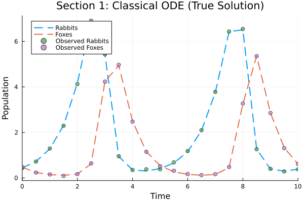
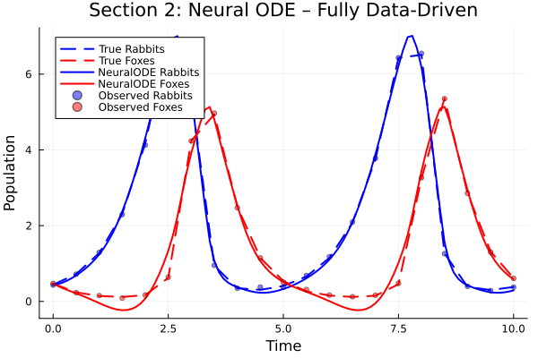
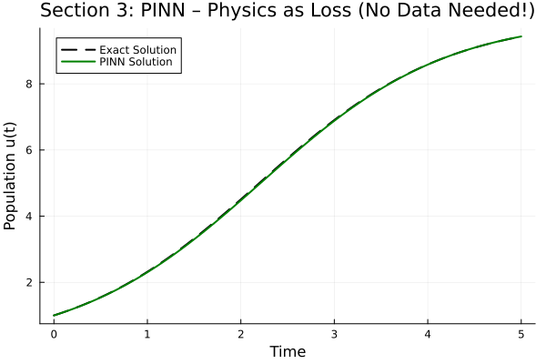
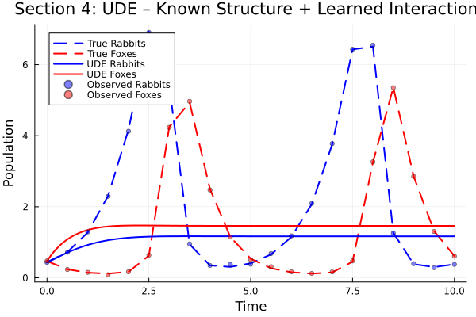
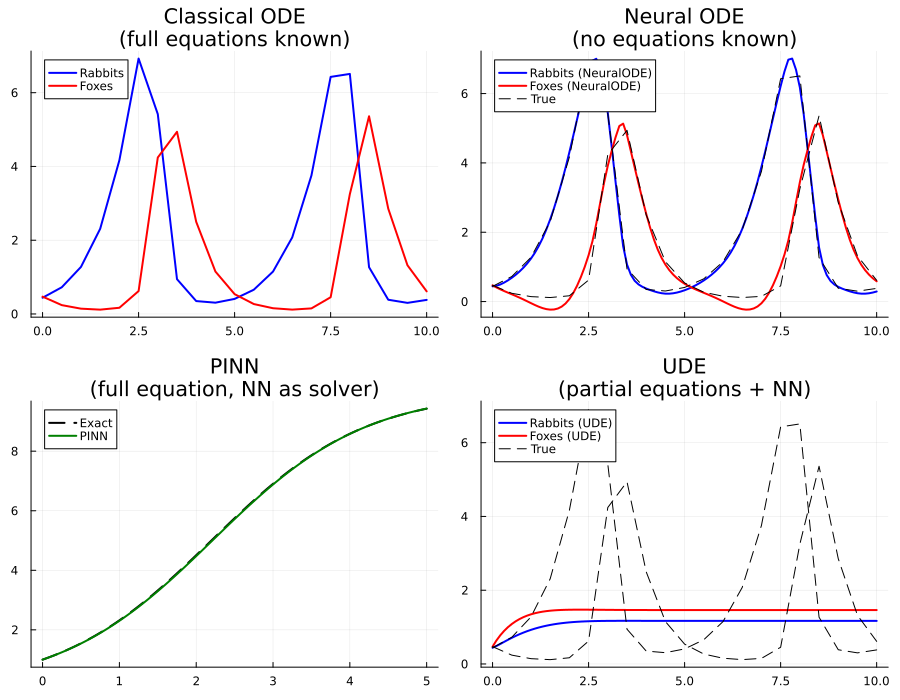

# NeuralODE, PINN, and UDE: A Beginner's Guide to AI-Augmented Science

*"A model is worth a thousand datasets."*
— Rackauckas et al., Universal Differential Equations for Scientific Machine Learning (2021)

---

## Introduction

Imagine you are a wildlife biologist tracking rabbit and fox populations in a forest. You take measurements every few months. You want to predict future populations, understand what drives their cycles, and perhaps figure out some hidden interaction you haven't modelled yet.

For centuries, scientists have used **differential equations** to describe how things change over time — from population dynamics and fluid flow to planetary orbits and electrical circuits. These equations are powerful, but they require you to already *know* the governing laws. What happens when you only know part of the physics, or none at all?

This is where three modern techniques — **Neural ODEs**, **PINNs**, and **UDEs** — enter the picture. They all sit at the intersection of machine learning and differential equations, but they answer different versions of the same question:

> *How do we model a dynamical system when we don't have complete knowledge?*

This post explains what each method is, builds up an intuition for how they work, and shows simple Julia code illustrating each approach — all using the same running example: rabbits and foxes.

---

## What Are Differential Equations?

Before diving into the AI-augmented methods, let's build up the foundation.

A **differential equation** describes how a quantity *changes* over time (or space), rather than describing the quantity itself directly.

### Intuitive Example: A Cooling Cup of Coffee

Suppose you make a coffee at 90°C and leave it in a 20°C room. The coffee cools faster when it is much hotter than the room, and more slowly as it approaches room temperature. Newton's Law of Cooling captures this:

```
dT/dt = -k * (T - T_room)
```

This reads: *"the rate of change of temperature equals some constant times the difference between the coffee's temperature and the room."*

You don't need to know the temperature at every future instant — you just need to know *how fast it changes*, and a solver figures out the rest.

### A Richer Example: Rabbits and Foxes

The **Lotka-Volterra** equations describe how a predator and prey population interact:

```
dx/dt =  α·x - β·x·y     (rabbits: births - predation losses)
dy/dt =  γ·x·y - δ·y     (foxes:   gains from hunting - natural deaths)
```

Here `x` is the rabbit population, `y` is the fox population, and α, β, γ, δ are constants describing birth rates, death rates, and how effectively foxes hunt rabbits.

The four terms have simple biological meanings:
- `α·x` — rabbits reproduce at rate α
- `β·x·y` — rabbits get eaten (more encounters when both populations are large)
- `γ·x·y` — foxes gain from eating rabbits
- `δ·y` — foxes die at rate δ

**Solving** this system means finding the trajectories `x(t)` and `y(t)` that satisfy both equations simultaneously, starting from some initial populations.

### Solving ODEs in Julia

Julia's `DifferentialEquations.jl` makes this straightforward:

```julia
using DifferentialEquations, Plots

function lotka_volterra!(du, u, p, _)
    x, y = u
    α, β, γ, δ = p
    du[1] = α * x - β * x * y   # rabbit dynamics
    du[2] = γ * x * y - δ * y   # fox dynamics
end

true_p = [1.3, 0.9, 0.8, 1.8]
u0     = [0.44, 0.47]
tspan  = (0.0, 10.0)

prob = ODEProblem(lotka_volterra!, u0, tspan, true_p)
sol  = solve(prob, Tsit5(), saveat=0.0:0.5:10.0)

plot(sol, labels=["Rabbits" "Foxes"], lw=2)
```

This gives you the oscillating predator-prey cycle you might expect: rabbit populations rise, which feeds more foxes, which then drive the rabbits down, causing fox populations to decline, and the cycle repeats.



This works perfectly when you know **all** the parameters α, β, γ, δ. But what if you don't?

---

## What Is a Neural ODE?

### The Core Idea

A Neural ODE asks: *what if we replace the right-hand side of the ODE with a neural network?*

In a classical ODE, you write the governing equations by hand:

```
du/dt = f(u, t)       ← f is hand-crafted from domain knowledge
```

In a **Neural ODE**, you have data (time-series observations) but no known equations. So you replace `f` with a neural network:

```
du/dt = NN_θ(u, t)    ← NN_θ is a neural network with parameters θ
```

You then **train** the neural network by:
1. Solving the ODE numerically (using a standard ODE solver)
2. Comparing the solution to your observed data
3. Backpropagating the error through the ODE solver to update the network weights

The key insight (from Chen et al., NeurIPS 2018) is that you can treat the ODE solver as a differentiable computation and propagate gradients through it using a technique called the **adjoint method**.

### Intuition: ResNets as Discrete ODEs

Think of a deep residual neural network (ResNet). Each residual layer computes:

```
h_{n+1} = h_n + f(h_n)
```

This looks exactly like Euler's method for integrating an ODE:

```
y(t + Δt) = y(t) + Δt · f(y(t), t)
```

A Neural ODE takes this analogy to its logical conclusion: instead of a fixed number of discrete layers, use a *continuous* flow of hidden states governed by a neural network ODE. This gives you:
- Fewer parameters (depth becomes continuous, not a fixed count)
- Adaptive computation (the solver takes more steps where the dynamics are complex)
- A natural framework for irregularly-spaced time series

### Julia Code: Neural ODE

```julia
using Lux, ComponentArrays, SciMLSensitivity
using Optimization, OptimizationOptimisers

# Neural network that replaces the unknown ODE right-hand side
nn_node = Lux.Chain(
    Lux.Dense(2, 32, tanh),
    Lux.Dense(32, 32, tanh),
    Lux.Dense(32, 2)
)

rng = Random.default_rng()
ps_node, st_node = Lux.setup(rng, nn_node)
ps_node = ComponentArray(ps_node)

# The ODE is now: du/dt = NN_θ(u)
function neural_ode_rhs!(du, u, p, _)
    pred, _ = nn_node(u, p, st_node)
    du[1] = pred[1]
    du[2] = pred[2]
end

prob_node = ODEProblem(neural_ode_rhs!, u0, tspan, ps_node)

# Loss: solve the Neural ODE and compare to observations
function loss_neural_ode(ps, _)
    pred = solve(prob_node, Tsit5(), p=ps, saveat=t_save,
                 sensealg=QuadratureAdjoint(autojacvec=ReverseDiffVJP(true)))
    !SciMLBase.successful_retcode(pred.retcode) && return Inf
    sum(abs2, Array(pred) .- ode_data)
end

# Train with the Adam optimiser
optf    = Optimization.OptimizationFunction(loss_neural_ode, Optimization.AutoZygote())
optprob = Optimization.OptimizationProblem(optf, ps_node)
result  = Optimization.solve(optprob, Adam(0.01), maxiters=500)
```

After training, the neural network has learned to mimic the Lotka-Volterra dynamics purely from the noisy observations — without ever being told the equations.



### What Makes It Special

| Feature | Neural ODE |
|---|---|
| Equations needed? | **No** — learned entirely from data |
| Data needed? | Yes — time-series observations |
| Output | A black-box continuous dynamical system |
| Strengths | Works when physics is completely unknown |
| Weaknesses | May not extrapolate well; no interpretability |

---

## What Is a PINN?

### The Core Idea

A **Physics-Informed Neural Network** flips the Neural ODE's premise. Instead of data-first, it is **physics-first**.

The scenario: you know the governing equation but you want a neural network to *solve* it — giving you a smooth, differentiable function `u(t)` as the answer, rather than a table of numerical values.

The clever trick is to build the physics directly into the **loss function**. The neural network `u_NN(t; θ)` is trained so that:

1. **Physics residual**: The ODE is approximately satisfied at many collocation points `t_1, t_2, ..., t_N`
2. **Boundary/initial condition**: The network value at `t=0` matches the known starting condition

```
Loss = mean[ (du_NN/dt - f(u_NN, t))² ]    ← physics residual
     + (u_NN(0) - u₀)²                      ← boundary condition
```

Because neural networks are differentiable, `du_NN/dt` can be computed exactly using automatic differentiation — no finite differences needed.

### Intuition: Teaching by Constraints, Not Examples

Normally, you teach a student by showing them examples ("here is the question, here is the answer"). A PINN instead teaches the network by giving it **rules** ("any function you output must satisfy this equation"). The network then figures out a function that obeys the rules everywhere.

This means **you need almost no training data** — just the equation and boundary conditions.

### Example: Logistic Growth

Let's use a simpler equation for the PINN demonstration. **Logistic growth** models a population that grows exponentially at first, then levels off as it approaches a carrying capacity `K`:

```
du/dt = r · u · (1 - u/K),    u(0) = u₀
```

This has a known analytical solution, making it easy to check accuracy:

```
u(t) = K / (1 + (K/u₀ - 1)·e^{-r·t})
```

### Julia Code: PINN

```julia
# Neural network represents the SOLUTION u(t) — not the derivative
pinn_net = Lux.Chain(
    Lux.Dense(1, 32, tanh),
    Lux.Dense(32, 32, tanh),
    Lux.Dense(32, 1)
)

ps_pinn, st_pinn = Lux.setup(rng, pinn_net)
ps_pinn = ComponentArray(ps_pinn)

# Helper: evaluate u_NN at scalar time t
function u_pinn(t_val::Number, ps)
    out, _ = pinn_net([t_val], ps, st_pinn)
    only(out)
end

# PINN loss = physics residual + boundary condition
function pinn_loss(ps, _)
    t_col = LinRange(0.0, 5.0, 50)   # collocation points

    physics_loss = mean(t_col) do t
        u_val = u_pinn(t, ps)
        # Automatic differentiation gives us du/dt exactly
        du_dt = ForwardDiff.derivative(τ -> u_pinn(τ, ps), t)
        # The ODE should hold: residual should be zero
        residual = du_dt - r_log * u_val * (1 - u_val / K_log)
        residual^2
    end

    bc_loss = (u_pinn(0.0, ps) - u0_log)^2   # initial condition

    return physics_loss + bc_loss
end
```

The remarkable thing: **no labelled `(t, u)` training pairs are used**. The only information fed to the network is the equation form and the initial condition `u(0) = 1`.



### What Makes It Special

| Feature | PINN |
|---|---|
| Equations needed? | **Yes** — the full governing equation |
| Data needed? | **No** (or very little) |
| Output | A smooth, differentiable function u(t) |
| Strengths | No mesh/grid required; handles complex PDEs; works with scattered data |
| Weaknesses | Hard to train for stiff or high-dimensional problems; slower than traditional solvers |

---

## What Is a UDE?

### The Core Idea

**Universal Differential Equations** (UDEs), introduced by Rackauckas et al. (2021), occupy the sweet spot between Neural ODEs and PINNs.

The scenario: you know *some* of the physics, but not all of it. Rather than discarding your knowledge (Neural ODE) or requiring the full equations (PINN), a UDE lets you **embed a neural network inside a known equation structure** to fill in the gaps.

Mathematically:

```
du/dt = known_physics(u, t) + NN_θ(u, t)
```

The neural network only needs to learn the *missing or uncertain parts* of the dynamics. Everything else is handled by your domain knowledge.

### Intuition: Filling in the Blanks

Think of writing an exam where you know most of the answer but one term is missing:

```
dx/dt = [α·x]  - [  ???  ]    ← we know rabbit births, not predation
dy/dt = [???]  - [  δ·y  ]    ← we know fox deaths, not hunting gains
```

A UDE fills in the `???` with a neural network trained on data. The result is:
- **More interpretable** than a pure Neural ODE (we kept the known structure)
- **Less data-hungry** than a pure Neural ODE (the network only needs to learn the unknown part)
- **More flexible** than a pure ODE (we don't need to know everything)

### Back to Rabbits and Foxes

Suppose you are a biologist who knows:
- Rabbits have a birth rate of α = 1.3 (measured independently)
- Foxes die at rate δ = 1.8 (measured independently)
- **But** you don't know the exact form of the predation term

Your UDE looks like:

```
dx/dt =  α·x + NN_θ(x, y)[1]    ← birth is known; predation is learned
dy/dt = -δ·y + NN_θ(x, y)[2]    ← death is known; hunting gain is learned
```

### Julia Code: UDE

```julia
α_known = 1.3   # rabbit birth rate (measured, certain)
δ_known = 1.8   # fox death rate    (measured, certain)

# Neural network learns ONLY the unknown interaction terms
nn_ude = Lux.Chain(
    Lux.Dense(2, 32, tanh),
    Lux.Dense(32, 32, tanh),
    Lux.Dense(32, 2)
)
ps_ude, st_ude = Lux.setup(rng, nn_ude)
ps_ude = ComponentArray(ps_ude)

# UDE: known physics + neural network for missing terms
function ude_dynamics!(du, u, p, _)
    x, y = u
    nn_out, _ = nn_ude(u, p, st_ude)
    du[1] =  α_known * x + nn_out[1]   # known birth  + learned interaction
    du[2] = -δ_known * y + nn_out[2]   # known death  + learned interaction
end

prob_ude = ODEProblem(ude_dynamics!, u0, tspan, ps_ude)

# Same training loop as Neural ODE — just the ODE function changed
function loss_ude(ps, _)
    pred = solve(prob_ude, Tsit5(), p=ps, saveat=t_save,
                 sensealg=QuadratureAdjoint(autojacvec=ReverseDiffVJP(true)))
    !SciMLBase.successful_retcode(pred.retcode) && return Inf
    sum(abs2, Array(pred) .- ode_data)
end
```

The UDE not only fits the data well, but the learned neural network can later be passed through a symbolic regression tool (like `DataDrivenDiffEq.jl`) to potentially *recover the true formula* for the interaction terms.



### What Makes It Special

| Feature | UDE |
|---|---|
| Equations needed? | **Partial** — only what you know |
| Data needed? | Yes — time-series observations |
| Output | A hybrid: known structure + learned component |
| Strengths | Best of both worlds; interpretable; data-efficient; enables equation discovery |
| Weaknesses | Requires some domain knowledge to set up the structure |

---

## Side-by-Side Comparison

Here are all four approaches applied to the predator-prey problem:



### Key Differences at a Glance

| | Classical ODE | Neural ODE | PINN | UDE |
|---|---|---|---|---|
| **What you need** | Full equations + parameters | Only data | Full equation (no data) | Partial equations + data |
| **What you get** | Exact trajectory | Black-box dynamics | Smooth function u(t) | Interpretable hybrid model |
| **Physics** | 100% explicit | None | Enforced via loss | Partially explicit |
| **Data** | None needed | Required | Not needed | Required |
| **Extrapolation** | Excellent | Poor (black box) | Good within domain | Good (guided by physics) |
| **Interpretability** | Full | Low | Medium | High |
| **Best for** | Known, well-validated physics | Completely unknown dynamics | Known equation, want a solver | Partial knowledge situations |

### When to Use Which?

**Use a Classical ODE** when you know and trust your equations. There is no reason to add a neural network if you already have the full model.

**Use a Neural ODE** when you have dense time-series data but no physical model to start from — e.g., learning latent dynamics from sensor data, or building a continuous-time recurrent model.

**Use a PINN** when you know the governing PDE but want a mesh-free solution, especially for complex geometries or when you want to incorporate sparse measurements directly into the solve. Also useful for inverse problems (discovering parameter values from data).

**Use a UDE** when you know part of the physics and have data. The UDE framework is the most flexible for scientific machine learning — it lets you encode domain knowledge while using data to fill in what you don't know, and the learned components can later be symbolically regressed to recover interpretable equations.

---

## A Note on the SciML Ecosystem

All the Julia code in this post is part of the **SciML ecosystem** — a collection of open-source Julia packages that make scientific machine learning practical:

- `DifferentialEquations.jl` — state-of-the-art ODE/PDE solvers
- `Lux.jl` — neural network library designed for composability with differential equations
- `SciMLSensitivity.jl` — adjoint methods for backpropagating through ODE solvers
- `Optimization.jl` — unified interface for gradient-based optimisation
- `DataDrivenDiffEq.jl` — symbolic regression from UDE-learned components

The SciML ecosystem is unique in offering all these tools in a unified, composable framework. As the UDE paper demonstrates, it supports stiff ODEs, SDEs, DDEs, and is over 100× faster than equivalent PyTorch implementations on scientific models.

---

## Conclusion

Differential equations are one of science's most powerful tools for describing how the world changes. The three methods explored here extend that power to situations where knowledge is incomplete:

- **Neural ODEs** say: *"I have data. Let a neural network be the equation."*
- **PINNs** say: *"I have an equation. Let a neural network be the solution."*
- **UDEs** say: *"I have some knowledge and some data. Let me combine them."*

None of these replaces classical differential equation modelling when the equations are known and trusted. But in the increasingly common situation where physics is partially known, experimental data is expensive, and interpretability matters, UDEs in particular offer a principled framework for merging the rigour of scientific modelling with the flexibility of machine learning.

The next step after mastering these tools is **equation discovery**: training a UDE, then using symbolic regression on the learned neural network component to recover a fully interpretable mathematical expression for the missing physics. That is where the promise of "scientific machine learning" truly begins to shine.

---

## Running the Code

All code in this post is in [blog_examples.jl](blog_examples.jl). To run it:

```bash
julia blog_examples.jl
```

You will need the following Julia packages (install once in the Julia REPL):

```julia
using Pkg
Pkg.add([
    "DifferentialEquations", "Lux", "ComponentArrays",
    "SciMLSensitivity", "Optimization", "OptimizationOptimisers",
    "ForwardDiff", "Zygote", "Plots", "Random", "Statistics"
])
```

The script saves four PNG plots to the working directory.

---

## Further Reading

- **Neural ODEs**: Chen et al., *Neural Ordinary Differential Equations*, NeurIPS 2018
- **PINNs**: Raissi, Perdikaris, Karniadakis, *Physics-informed neural networks*, Journal of Computational Physics, 2019
- **UDEs**: Rackauckas et al., *Universal Differential Equations for Scientific Machine Learning*, arXiv 2001.04385
- **SciML Docs**: [docs.sciml.ai](https://docs.sciml.ai)
